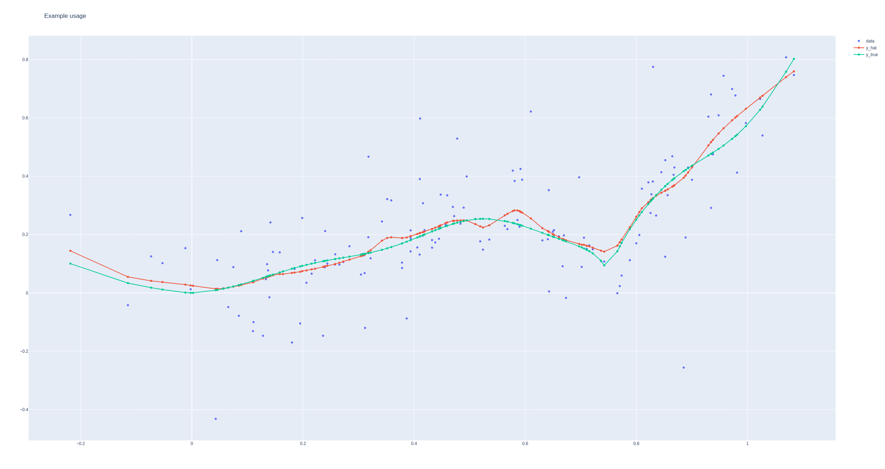

# Robust Local Polynomial Regression with Similarity Kernels #

This repository is intended to share and facilitate community contribution for completing the research and implementation 
presented in the [Robust Local Polynomial Regression with Similarity Kernels draft paper](https://github.com/yaniv-shulman/rsklpr/tree/main/paper/rsklpr.pdf). The repository contains
the source for the paper and a demonstrative implementation of the proposed method for the 1D predictor including
several experimental results. Note the paper is a draft and the code is for demonstrative purposes still so both may
contain issues.

### Contribution and feedback ###

Contributions and feedback are most welcome to the paper and code in any area related to:
- Further development of the method and completing the paper:
  - Asymptotic analysis of the estimator
  - Improving related work coverage
  - Improving or adding experiments and the presentation of experiments including comparison to other robust LPR methods
  - Experimenting with robust estimators e.g. robust losses, robust bandwidth estimators and robust KDEs
  - Proposing and experimenting with different similarity kernels
  - Fixing issues
- Adding and improving functions in the implementation:
  - Implement and demonstrate multidimensional regression
  - Memory efficient implementation for supporting larger datasets and neighborhoods. The current implementation uses
vectorized calculations that require relatively large amounts of memory. This imposes limitations on the
neighbourhood/dataset size that may be used.
  - Computational efficient LSCV implementation (The current implementation is naive iterative leave-one-out)
  - Implementing additional KDE factors and bandwidth selection
  - Additional kernels
  - Improving numerical stability
  - Confidence intervals
  - Implementing in other languages e.g. R
- Productionzing the code:
  - Adding linting
  - Adding input checks and error handling
  - Tests
  - Packaging

- And more...

To contribute please submit a pull request, create an issue or get in touch by email to the address specified in the
paper.

### How do I get set up? ###
The easiest way to setup for development or explore the code is to create or activate a Poetry virtual environment by
executing configure.sh. The included development environment uses Python 3.10 and Poetry 1.6.1 or higher is recommended.
If you require any help getting setup please get in touch by email to the address specified in the paper.

### Example usage ###

```python
import numpy as np
import pandas as pd

from experiments.common import plot_results, ExperimentConfig
from experiments.data.synthetic_benchmarks import benchmark_curve_1
from rsklpr.rsklpr import (
    Rsklpr1D,
)

experiment_config: ExperimentConfig = ExperimentConfig(
    curve=benchmark_curve_1,
    size_neighborhood=50,
    noise_ratio=0.3,
    hetero=True,
    num_points=150,
    response_bandwidth="lscv_global",
)

x: np.ndarray
y: np.ndarray
y_true: np.ndarray

x, y, y_true = experiment_config.curve(
    experiment_config.noise_ratio,
    experiment_config.hetero,
    experiment_config.num_points,
)

rsklpr: Rsklpr1D = Rsklpr1D(
    size_neighborhood=experiment_config.size_neighborhood,
    response_bandwidth=experiment_config.response_bandwidth,
)

y_hat: np.ndarray = rsklpr(
    x=x,
    y=y,
)

estimates: pd.DataFrame = pd.DataFrame(index=x)
estimates["y_hat"] = y_hat
estimates["y_true"] = y_true

plot_results(
    x=x,
    y=y,
    estimates=estimates,
    title="Example usage",
)
```


### Experimental results ###
The experimental results are available as interactive Jupyter notebooks at 
https://nbviewer.org/github/yaniv-shulman/rsklpr/tree/main/src/experiments/
